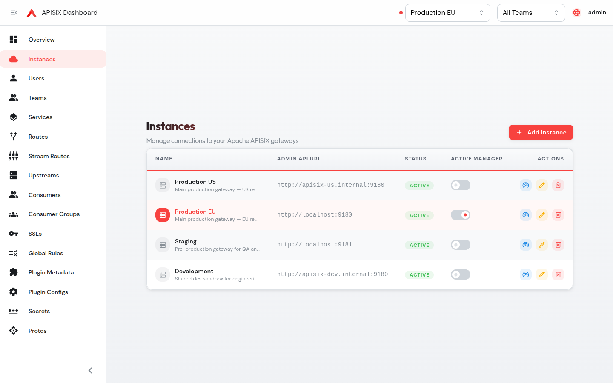

# Multi-Tenant APISIX Dashboard

[](./LICENSE)



A multi-tenant control plane for [Apache APISIX](https://github.com/apache/apisix), forked from [apache/apisix-dashboard](https://github.com/apache/apisix-dashboard).

Where the upstream dashboard is a single-page app that talks directly to one APISIX Admin API using a shared admin key, this fork adds a **Go backend** in front that provides:

- **User accounts** with bcrypt-hashed passwords and JWT-based login (no more sharing the admin key with everyone).
- **Multiple APISIX instances** registered through the UI — one dashboard, N gateways (staging, prod, per-region, …).
- **Teams** as the tenancy unit, with per-resource ownership.
- **Per-instance roles**: `super_admin`, `instance_admin`, `developer`, `viewer`. The same user can be admin on staging and viewer on prod.
- **Label-based classification** for routes and other resources, with backend-enforced validation.
- **OpenAPI import/export** for routes.
- **Live route tester** (curl-style) and **upstream connection tester** directly from the UI.
- **Overview dashboard** with gateway health and consolidated counts across instances.

The frontend (React + TanStack Router + Mantine + Ant Design Pro) and most of the resource forms come from upstream; the `api/` directory and the new top-level pages (`login`, `overview`, `instances`, `teams`, `users`) are the multi-tenant additions.

## Quick start

You need: Docker (for APISIX + etcd), Node 22 + pnpm 10, and Go 1.22+ (with toolchain auto-download for the 1.24 declared in `api/go.mod`).

```sh
# 1. Bring up APISIX + etcd
docker compose -f e2e/server/docker-compose.yml up -d

# 2. Build and run the Go backend (port 8086, JWT auth in front of APISIX)
mkdir -p bin
go build -C api -o ../bin/api ./cmd
PORT=8086 \
  ETCD_ENDPOINTS=http://localhost:2379 \
  JWT_SECRET="$(openssl rand -hex 32)" \
  ADMIN_PASSWORD=admin \
  ./bin/api &

# 3. Install JS deps and start the Vite dev server (port 5173)
pnpm install --frozen-lockfile
pnpm dev
```

Open <http://localhost:5173/ui> and log in with `admin / admin`. Change the password immediately from the user menu.

See [`docs/en/development.md`](./docs/en/development.md) for the full dev setup, including how to run multiple APISIX instances and how the auth/proxy flow works.

## Architecture

```
┌──────────────┐   JWT Bearer   ┌────────────────┐  X-API-KEY  ┌──────────────┐
│   Browser    │ ─────────────▶ │  Go backend    │ ──────────▶ │  APISIX A    │
│  React SPA   │  X-Instance-ID │  (Gin, :8086)  │             │  (:9180)     │
│              │  X-Team-ID     │                │             └──────────────┘
└──────────────┘                │  + etcd        │             ┌──────────────┐
                                │   (users,      │ ──────────▶ │  APISIX B    │
                                │   teams,       │             │  (:9181)     │
                                │   instances,   │             └──────────────┘
                                │   roles,       │                    ...
                                │   ownership,   │
                                │   labels)      │
                                └────────────────┘
```

The dashboard never holds an APISIX admin key in the browser — it ships only JWTs. The backend looks up the target instance by `X-Instance-ID`, attaches that instance's admin key server-side, and proxies the request.

## Versioning

This project is an independent fork of [`apache/apisix-dashboard`](https://github.com/apache/apisix-dashboard): the resource UI derives from upstream, while the multi-tenant features (Go backend, JWT auth, teams, instances, per-instance roles) live on `main`. Releases use independent semver (`vMAJOR.MINOR.PATCH`) on the fork's own cadence rather than mirroring upstream tag-for-tag; the first release is `v0.1.0`.

### APISIX compatibility

The dashboard speaks the APISIX **Admin API v3**: it reads the `{ "list": [...], "total": N }` list response (see `src/config/req.ts`) and carries no v2 (`node`/`nodes`) fallback, so **Apache APISIX 3.x is required — 2.x is not supported**. Within the 3.x line, the supported floor is set by the newest Admin API resources the UI surfaces:

| Capability | Minimum APISIX |
| --- | --- |
| Core resources (routes, services, upstreams, consumers, ssls, global_rules, plugin_configs, protos, stream_routes, consumer_groups) | 3.0 |
| `secrets` resource | 3.1 |
| Consumer `credentials` resource | 3.11 |

So core resource management works against **APISIX 3.0+**, while the full feature set (including consumer credentials) needs **3.11+**, through the current stable **3.16**. CI runs the e2e suite against a pinned **`apache/apisix:3.16.0-debian`** — see [`e2e/server/Dockerfile`](./e2e/server/Dockerfile) and [`e2e/server/docker-compose.yml`](./e2e/server/docker-compose.yml). To move the tested line, bump that pin and cut a new fork release.

## Contributing

This fork is public and accepts contributions. See [CONTRIBUTING.md](./CONTRIBUTING.md) and [CODE_OF_CONDUCT.md](./CODE_OF_CONDUCT.md).

## Trademark

APISIX® is a registered trademark of The Apache Software Foundation. This project is an **independent fork** of `apache/apisix-dashboard` and is **not affiliated with, endorsed by, or sponsored by** the Apache Software Foundation. The name "Multi-Tenant APISIX Dashboard" describes what the project does — provide a multi-tenant dashboard for Apache APISIX — and is used in accordance with [Apache's trademark guidelines for downstream projects](https://www.apache.org/foundation/marks/).

## License

[Apache License 2.0](./LICENSE) — same as upstream. See [NOTICE](./NOTICE) for attribution.
